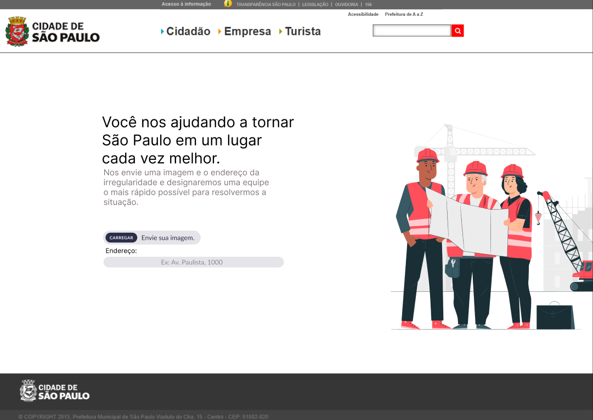

# Challeng Sprint 4 - IA & IoT

# Solution NET

## Descrição do Projeto

Projeto que utiliza HTML5, CSS3 e JavaScript para simular um front-end para o armazenamento de imagens carregadas por usuários.

 <a href="#tecnologias">Tecnologias</a> • 
 <a href="#autor">Autores</a>

<h3 align="center"> 
	✔️ Concluído ✔️
</h3>

### Features

- [x] Upload de imagem do usuário
- [x] Validação de formato da imagem e de campos preenchidos

<h4>Protótipo no figma:</h4>
<h1 align="center">
  
</h1>

<h4>Versão final do front-end:</h4>
<h1 align="center">
  
</h1>

### 🛠 Tecnologias

Foram utilizadas linguagens de programação básica de front-end, sendo essas:

-HTML5
-CSS3
-JavaScript

### ✍️ Autores

<ul>
  <li>Gabriel Candido Sena da Silva</li>
  <li>Matheus Correa de Sousa</li>
  <li>Jéssica Souza Felix</li>
  <li>Beatriz de Freitas Fernandes</li>
  <li>Gabriel Aljarila dos Santos</li>
  <li>Rafael Fernandes de Carvalho</li>
  <li>Guilherme Melo Leal</li>
</ul>

